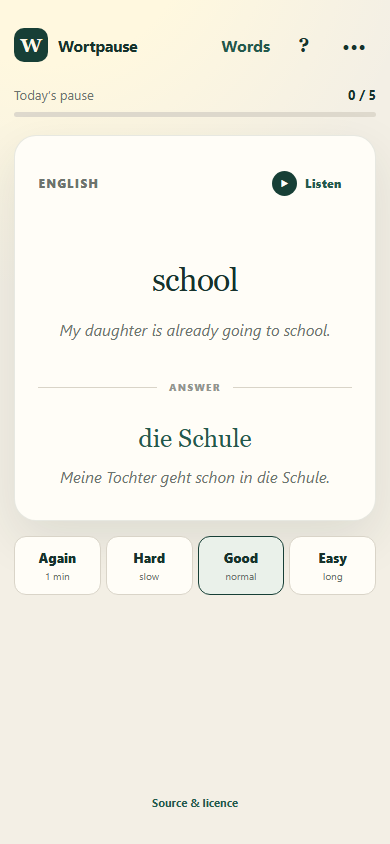
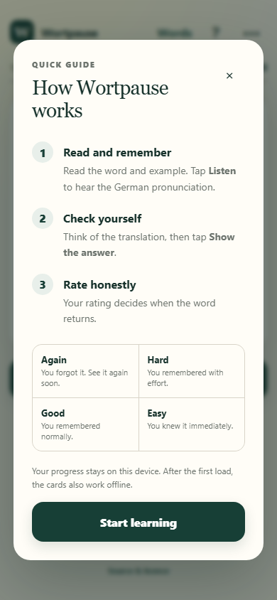
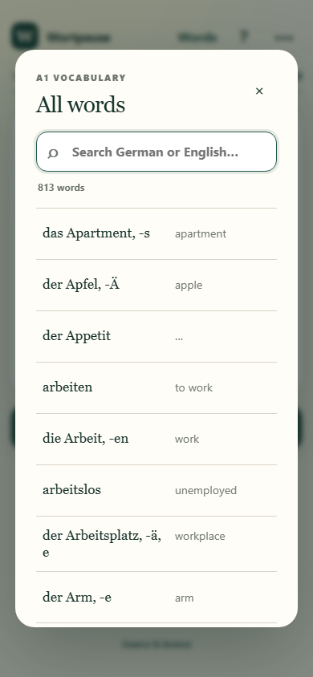

<div align="center">
  
  <h1>Wortpause</h1>
  <p><strong>German A1 vocabulary practice for the quiet moments in your day.</strong></p>

  [](https://github.com/necromancer124/Wortpause/actions/workflows/android-release.yml)
  [](https://github.com/necromancer124/Wortpause/releases/latest)
  
</div>

Wortpause is a mobile-first flashcard app with the complete Goethe A1 German vocabulary deck. It includes pronunciation, example sentences, a searchable word browser, and simple spaced repetition—all available offline.

## Download for Android

Download **`Wortpause-Android.apk`** from the [latest release](https://github.com/necromancer124/Wortpause/releases/latest).

1. Open the APK on an Android phone.
2. If prompted, allow **Install unknown apps** for the browser or file manager.
3. Tap **Install**.

The app supports **Android 7.0 and newer**. Android may display a warning because Wortpause is privately distributed rather than downloaded from Google Play.

## Preview

| Learn | Guide | Browse all words |
|:---:|:---:|:---:|
|  |  |  |

## Features

- **813 German–English cards** with pronunciation and example sentences
- German → English and English → German study directions
- **Again / Hard / Good / Easy** spaced-repetition ratings
- Searchable and scrollable browser for the complete word list
- Expandable German and English examples
- 5, 10, or 20-card study sessions
- Local progress, daily streaks, and no account required
- Offline cards and bundled pronunciation audio in the Android app
- Installable web app for browsers that support PWAs

## Run locally

Requirements: Node.js 22 or newer.

```bash
npm ci
npm test
npm run serve
```

Open <http://localhost:4173>.

## Build the Android APK

Requirements: Java 21 and Android SDK 36.

```bash
npm ci
npm run android:sync
cd android
./gradlew assembleDebug
```

On Windows Git Bash, use `./gradlew.bat assembleDebug`. The APK is created at `android/app/build/outputs/apk/debug/app-debug.apk`.

## Automatic releases

Every push runs [the Android release workflow](.github/workflows/android-release.yml). GitHub Actions audits and tests the app, creates a signed installable APK, verifies its signature, saves it as a workflow artifact, and publishes it in a new GitHub Release. Releases use one persistent signing key stored in encrypted repository secrets, so newer APKs can be installed as updates over earlier releases. No local Android toolchain is needed to download a build.

## Data and privacy

Wortpause has no login and no analytics. Study progress is stored locally on the device.

## Attribution and licence

Vocabulary, translations, examples, and audio are adapted from [*Goethe Institute A1 Wordlist*](https://github.com/patsytau/anki_german_a1_vocab) by Patrizia and are licensed under [CC BY-SA 4.0](https://creativecommons.org/licenses/by-sa/4.0/). See [ATTRIBUTION.md](ATTRIBUTION.md).
